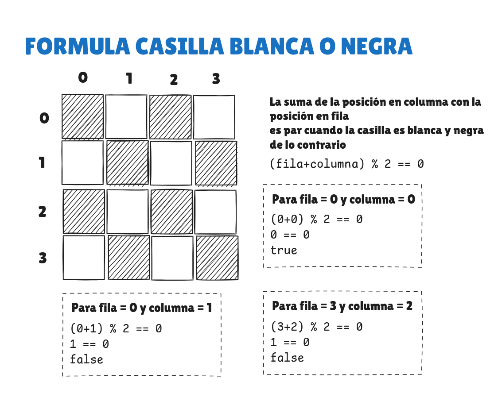
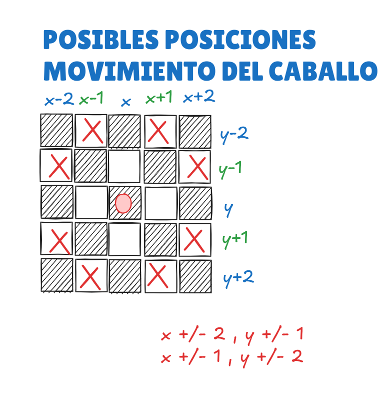

# TABLERO DE AJEDREZ
Tablero de ajedrez en consola basado en la lectura y escritura de archivos de datos de juego desarrollado
bajo el patron de arquitectura MVC
- Lectura de archivos [PGN(Portable Game Notation)](https://en.wikipedia.org/wiki/Portable-Game-Notation)
- El tablero se imprime en consola con los caracteres en unicode de cada una de las piezas del ajedrez

|       | **a** | **b** | **c** | **d** | **e** | **f** | **g** | **h** |
|-------|-------|-------|-------|-------|-------|-------|-------|-------|
| **8** | ♖     | ♘     | ♗     | ♕     | ♔     | ♗     | ♘     | ♖     |
| **7** | ♙     | ♙     | ♙     | ♙     | ♙     | ♙     | ♙     | ♙     |
| **6** |       |       |       |       |       |       |       |       |
| **5** |       |       |       |       |       |       |       |       |
| **4** |       |       |       |       |       |       |       |       |
| **3** |       |       |       |       |       |       |       |       |
| **2** | ♟     | ♟     | ♟     | ♟     | ♟     | ♟     | ♟     | ♟     |
| **1** | ♜     | ♞     | ♝     | ♛     | ♚     | ♝     | ♞     | ♜     |


## Instalación y ejecución
- Descargar .zip del codigo fuente del proyecto o clonar repositorio:    
````    git clone https://github.com/Camilo-845/Chess_PGN_Reader.git    ````
- Abrir directorio con el IDE de su preferncia (recomendablemente IntelliJ)
- Ejecutar desde el archivo src/main

## Mapeo del trablero

### Valores para matriz de tablero
| **PIEZA**   | **BLANCO** | **NEGRO** |
|:------------|:----------:|:---------:|
| **NINGUNA** |     0      |     0     |
| **PEON**    |     1      |    -1     |
| **TORRE**   |     2      |    -2     |
| **CABALLO** |     3      |    -3     |
| **ALFIL**   |     4      |    -4     |
| **REY**     |     5      |    -5     |
| **REINA**   |     6      |    -6     |

#### Ejemplo de tablero inicial:
````
-2,-3,-4,-6,-5,-4,-3,-2
-1,-1,-1,-1,-1,-1,-1,-1
0,0,0,0,0,0,0,0
0,0,0,0,0,0,0,0
0,0,0,0,0,0,0,0
0,0,0,0,0,0,0,0
1,1,1,1,1,1,1,1
2,3,4,5,6,4,3,2
````

### Mapeo de valores de matriz a unicode

| **VALOR**   | 1 | 2 | 3 | 4 | 5 | 6 | -1 | -2 | -3 | -4 | -5 | -6 |
|-------------|---|---|---|---|---|---|----|----|----|----|----|----|
| **UNICODE** | ♟ | ♜ | ♞ | ♝ | ♚ | ♛ | ♙  | ♖  | ♘  | ♗  | ♔  | ♕  |

## INMAGENEES DE CONCEPTUALIZACION

